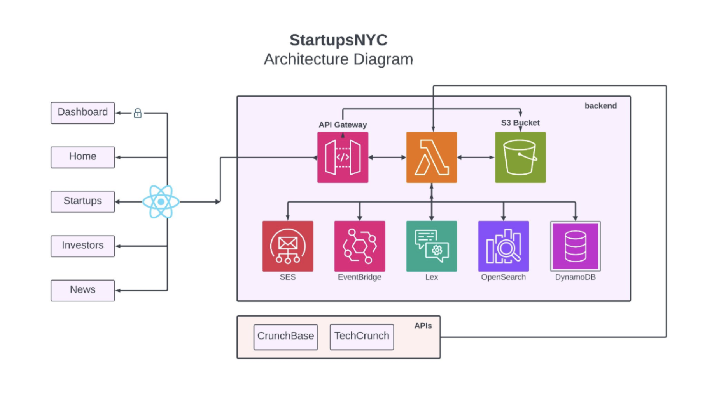

# StartupsNYC

### Team Members: 
Céline Gauchey, Lexa Huang, Sam Friedman

### Overview:
StartupsNYC is a AWS cloud-based startup ecosystem mapping platform that allows users to:

- Search and filter startups and investors by various requirements.
- Personalize their experience by saving specific startups and investors to their accounts.
- View daily updated news.
- Receive newsletters sent directly to their emails.

## Features

### 1. Search and Filter Startups/Investors
- **Data Storage**: Full info stored in DynamoDB; subset in OpenSearch.
- **Filtering**: OpenSearch queries via Lambda for specific requirements.
- **Search Function**: Lambda and Amazon Lex process queries before passing to OpenSearch.
- **API Integration**: Lambda functions connect to API Gateway endpoints.

### 2. Authentication
- **Implementation**: Node.js package in AWS Lambda.
- **Capabilities**: Registers users, logs in, verifies JWT tokens.
- **Data Storage**: User info in DynamoDB table `users`.

### 3. User Personalization
- **Save/Unsave Items**: Users can save/unsave startups and investors.
- **API Integration**: API Gateway endpoints handle selected items.
- **Data Storage**: Stored in DynamoDB under `saved_startups` and `saved_investors`.
- **View Saved Items**: Retrieved via Lambda querying DynamoDB.

### 4. News
- **Web Scraping**: Scrapes TechCrunch and stores in DynamoDB table `news`.
- **Scheduled Updates**: Daily updates via EventBridge schedule `news_trigger`.
- **API Integration**: Lambda retrieves and displays news from DynamoDB.

### 5. Email Newsletter
- **Sign-Up Option**: Users can opt-in for daily email newsletters.
- **Email Sending**: Lambda sends news via AWS SES.
- **Scheduled Sending**: Daily triggers via EventBridge schedule.

## Other AWS Services

### CodePipeline and CodeBuild
- **CI/CD Tool**: Deploys new commits to S3 bucket.

### S3
- **Website Hosting**: Hosted on an S3 bucket. Unfortunately the live demo is not available anymore as we ran out of AWS credits.
